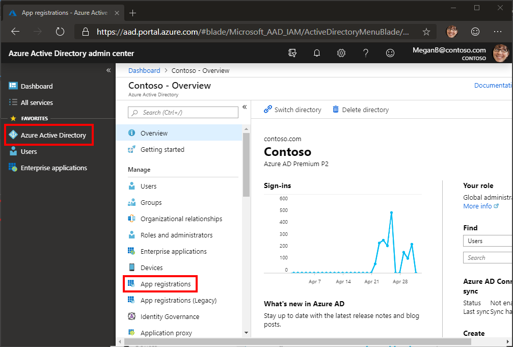
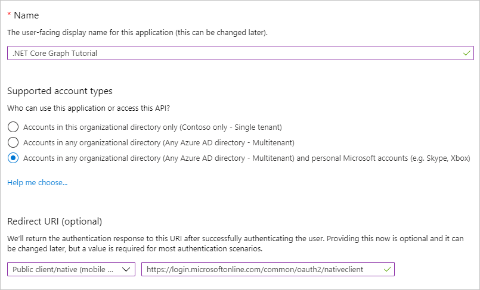

<!-- markdownlint-disable MD002 MD041 -->

В этом упражнении вы создадите новое приложение Azure AD с помощью центра администрирования Azure Active Directory.

1. Откройте браузер и перейдите в [Центр администрирования Azure Active Directory](https://aad.portal.azure.com) и войдите с помощью **личной учетной записи** (т.е. учетной записи Майкрософт) или **рабочей или учебной учетной записи**.

1. Выберите **Azure Active Directory** на панели навигации слева, затем выберите **Регистрация приложений** в разделе **Управление**.

    

1. Выберите **Новая регистрация**. На странице**Зарегистрировать приложение** задайте необходимые значения следующим образом.

    - Введите **имя** `.NET Core Graph Tutorial`.
    - Введите **поддерживаемые типы учетных записей** для **учетных записей в любом каталоге организаций и личных учетных записей Microsoft**.
    - Оставьте поле **URI перенаправления** пустым.

    

1. Выберите **регистр**. На странице **учебника по базовому графику .NET** СКОПИРУЙТЕ значение **идентификатора Application (Client)** и сохраните его, он понадобится на следующем шаге.

    

1. Выберите ссылку **Добавить URI перенаправления** . На странице " **Перенаправление URI** " выберите раздел **Перенаправление URI для общедоступных клиентов (мобильный, Настольный)** . Выберите `https://login.microsoftonline.com/common/oauth2/nativeclient` универсальный код ресурса (URI).

    

1. Найдите раздел **Тип клиента по умолчанию** и измените **приложение рассматривать как общедоступный клиент** на **Да**, а затем нажмите кнопку **сохранить**.

    
